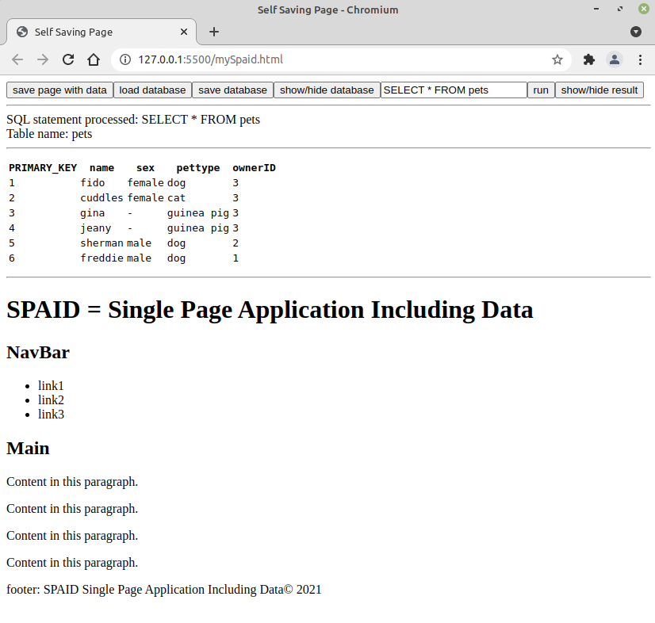
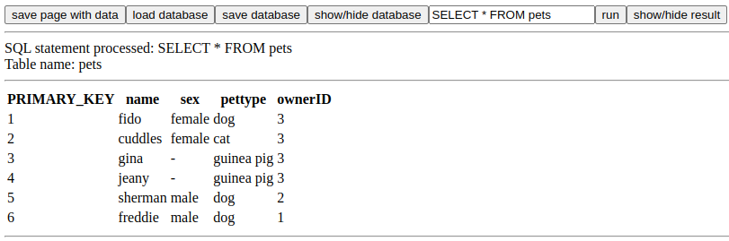

# spaid
Self-saving PAge Including Data
or
Single Page Application Including Database

### Please note webpages built should be opened directly as a file, not with a live server.

This project has been brewing in the back of my mind for a while.

The overall purpose of the project is allow one to make programs that
run in a browser locally and contain within the page a database like object.

Then before closing the page, you can save it and a copy of the page
saving the current data is saved.

This solves several problems:
1) It runs basically anywhere a browser is installed, ie cross-platform.
2) Utilizes html/css to make graphical user interfaces, which is quick and looks nice.
3) Allows for data persistence between sessions.
4) Does not require extra dependencies like NodeJS or Electron etc.
5) Does not require any software installation or modifications to OS.
6) Requires no connection to database, database like object is included.

The way I intend to solve these problems is as follows:

A script is included in an html file.
The script does the following:
The script will check to see if a div element is present within
  the document with an id of "spaid-data".
  If that element is not present, it is made.  If it is present do nothing.
A SAVE button is added to the page.
When the save button is clicked, the script makes a copy of the web page including
  the div (with id of "spaid-data"), and saves a copy of the page with the data.
  
When this saved page is opened, it will contain the persistent data.

You can save the database and load it in manually, or you can save a copy of the page with the database.
The databases are loaded and saved in JSON format.  If you want to continually save over the same
file, like you might as in the case of a word processor like operation you can, but until the program
is tested more I'd recommmend using new filenames between sessions.

The webpage contains a div which is hidden containing a JSON database-like object.

The database controls are:
- `save` - saves a copy of the current webpage containing the database in a hidden div.
- `save database` - which will save a copy of the JSON datbase like object which is hidden in the div.
- `load database` - which will load in the database to the hidden div for use in the web page.
- `show/hide database` - which will toggle the hidden div containing the JSON database-like object.
- `an input box` - you put SQL statments in there.
- `run button` - which will execute the SQL statments.
- `a show/hide results button` which toggles a tabular format showing the results of the SQL statments.

`The input box and run button can be used to build a database and you can inspect the results
as you build.  You can build your database here much like you might with command line in MariaDB.`

Or you can load do it programatically.  I am working on a dump like function which will allow 
the interpreter to loop through SQL statements and I plan to add a button to the buttons bar 
which will allow for execution of sequential SQL statements.

There are a bunch of functions but they are really intended to be funneled to one central
function sqlQuery.

The syntax is like this:
`myTable = sqlQuery(strSQLstring);`

`The query string always returns a table which is an array of objects with attached metadata.`

I will build a better test page using the attached 'database like object' which is currently non-relational.
Now that the project has gotten to a point where it can be used, I will build my first application
with it soon.

What is more important to me with this project is persistence between sessions and self-containment, not
so much that it is relational.

`I'd simply like to be able to write some nicely interfaced basic desktop programs 
without the extreme solution of installing a complete server solution to serve and store data.`

`I also want to be able to open the page anywhere without installing 
anything to the pc, so I can write programs that I can use on my work computers.`

The function returns a "table" which is an array or objects.  The array is indexed, the 
rows are objects and their column names are the keys, and the values are the cell data.
The metadata about the table like the name, the next primary key value and the column names
and data types, are attached as properties of the "table" array.

To summarize the table it returns is an array of objects.  So you usually don't think of arrays 
as having properties.  But since arrays are objects, you can attach "properties" to the arrays.
So the arrays will have index rows like:

`thisRowObject = dbObject["mytable"][0];  will return the first row in a table.`

but

`myTableName = dbObject["mytable"]["TABLE_NAME"]; will return the attached property of the table, in this case the name.`

likewise

`thisCustomerID = dbObject["mytable"][3]["customerID"]; will return the customerID found at row 3 in mytable`

but

`thisDataType = dbObject["mytable"]["customerID]; will return "NUMBER" or "STRING" depending on the datatype.`
`

Every time a table is created for example `customers` there will be a second table called `customers_METADATA` which
contains the TABLE_NAME, NEXT_PRIMARY_KEY, and column names and datatypes (STRING or NUMBER).

You can use the built in SQL interpreter to build a database or inspect it.  The interpreter calls the sqlQuery function
and displays a result in a tabular form.  If you call the sqlQuery function in the program the tabular form is not displayed.

Either way something is written to the console to be inspected.

To use, add the javascript reference before the end of the body and it will insert a fresh
'database' if there isn't one present.

It is essentially not styled, but I would exect someone to only display the save and perhaps
save database and load database functions.  The styling is left up to the user.  I envision a little button or maybe 
transulcent bar at the top of the browser or maybe something like what 'citrix' does. in terms of looks.

Currently, if there is not database present in the webpage, a sample webpage of pet owners and
pets is loaded in the sample webpage mySpaid.html.

There is a SQL interpreter with visualization of both the tables and the database available
at the top of the web page.

Please see the list of keywords, acceptable SQL statments and type-in tutorial below.  I think I may make a series of sql statments
that can be read in to the interpreter separated by ; like in a sqlDump, but for now this is all the further I've made it with the project.

Right now you can only INNER JOIN two tables, but you can insert the result to another table.  
Then you can rename the columns, then repeat another INNER JOIN.  The INNER JOIN always returns column names which are combined
like customers_customerID and with the _ instead of the . notation. 

<pre>
Available datatypes are STRING or NUMBER.

Available SQL statements:
-----------------------------
CREATE TABLE table_name (column1 datatype, column2 datatype, column3 datatype...);
SHOW TABLES;
DESCRIBE table_name;
DROP TABLE table_name;
ALTER TABLE table_name ADD column_name datatype;
ALTER TABLE table_name DROP COLUMN column_name;
ALTER TABLE table_name CHANGE samename samename datatype;
ALTER TABLE table_name CHANGE oldname newname samedatatype:
ALTER TABLE table_name CHANGE oldname newname newdatatype;
INSERT INTO table_name (column1, column2, column3, ...) VALUES (value1, value2, value3, ...);
UPDATE table_name SET column1 = value1, column2 = value2, ... WHERE condition;
DELETE FROM table_name WHERE condition;
SELECT * FROM table_name;
SELECT column1, column2, ...FROM table_name;
SELECT column1, column2, ... FROM table_name WHERE condition;
SELECT column1, column2, ... FROM table_name ORDER BY column1, column2, ... ASC|DESC;
SELECT column1, column2, ... FROM table1 INNER JOIN table2 ON table1.column_name = table2.column_name;
INSERT INTO newtable [a SELECT statement];
HELP

Reserved Keywords:
-----------------------------
INNER, JOIN, SELECT, INSERT, INTO, UPDATE, DELETE, CREATE, DROP, TABLE, SHOW, TABLES, DESCRIBE, HELP, SET,
WHERE, VALUES, ON, PRIMARY_KEY, NEXT_PRIMARY_KEY, _METADATA, STRING, NUMBER, =, !=, <>, >=, <=, >, <, *

Notes:
-----------------------------
 Datatypes are STRING and NUMBER.
 ; not needed.
 '' or "" not needed.
 CAPITALIZATION of keywords is required.
 All tables are autoincremented starting at 1.
 Column name of primary key is PRIMARY_KEY.
 INNER JOIN will give back combined column names, but can be renamed

Examples/Tutorial:
-----------------------------
CREATE TABLE owners (firstname STRING, lastname STRING, email STRING, age NUMBER);
INSERT INTO owners (firstname, lastname, email) VALUES ('John', 'Jones', 'john@gmail.com');
INSERT INTO owners (firstname, lastname, email, age) VALUES ('David', 'Davis', 'ddavis@gmail.com',73);
INSERT INTO owners (firstname, lastname, email) VALUES ('Justin', 'Thyme', 'justint@gmail.com');
CREATE TABLE pets (name STRING, sex STRING, pettype STRING, ownerID NUMBER);
SHOW TABLES;
SELECT * FROM owners;
SELECT * FROM pets;
INSERT INTO pets (name, sex, pettype, ownerID) VALUES ('fido', 'female', 'dog', 3);
INSERT INTO pets (name, sex, pettype, ownerID) VALUES ('cuddles', 'female', 'cat', 3);
INSERT INTO pets (name, pettype, ownerID) VALUES ('gina', 'guinea pig', 3);
INSERT INTO pets (name, pettype, ownerID) VALUES ('jeany', 'guinea pig', 3);
INSERT INTO pets (name, sex, pettype, ownerID) VALUES ('sherman', 'male, 'dog', 2);
INSERT INTO pets (name, sex, pettype, ownerID) VALUES ('freddie', 'male', 'dog', 1);
UPDATE pets SET sex = 'male', name = 'gene' WHERE name ='gina';
SELECT * FROM pets;
UPDATE pets SET sex = 'male', ownerID = 5 WHERE pettype = guinea pig;
ALTER TABLE pets ADD weight NUMBER;
UPDATE pets SET weight = 70 WHERE name = sherman;
DESCRIBE pets;
SELECT owners.PRIMARY_KEY, pets.ownerID, owners.firstname, pets.name FROM owners INNER JOIN pets ON owners.PRIMARY_KEY = pets.ownerID;
INSERT INTO petDirectory SELECT pets.ownerID, owners.firstname, pets.name FROM owners INNER JOIN pets ON owners.PRIMARY_KEY = pets.ownerID;
DESCRIBE petDirectory;
SELECT * FROM petDirectory;
ALTER TABLE petDirectory CHANGE pets_ownerID ownerID STRING;
ALTER TABLE petDirectory CHANGE pets_name name STRING;
ALTER TABLE petDirectory CHANGE owners_firstname owner STRING;
SHOW TABLES;
INSERT INTO directory SELECT * FROM petDirectory;
SHOW TABLES;
DROP TABLE petDirectory;
SHOW TABLES;
ALTER TABLE owners ADD telephone STRING;
UPDATE owners SET telephone = "3042321000" WHERE PRIMARY_KEY = 2;
DESCRIBE owners;
ALTER TABLE owners CHANGE telephone telephone NUMBER;
DESCRIBE owners;
SELECT * FROM owners;
INSERT INTO dogsOnly SELECT * FROM pets WHERE pettype = dog ORDER BY ownerID DESC;
SELECT * FROM dogsOnly;
ALTER TABLE dogsOnly DROP COLUMN pettype;
INSERT INTO dogNames SELECT name FROM dogsOnly;
SHOW TABLES;
</pre>
