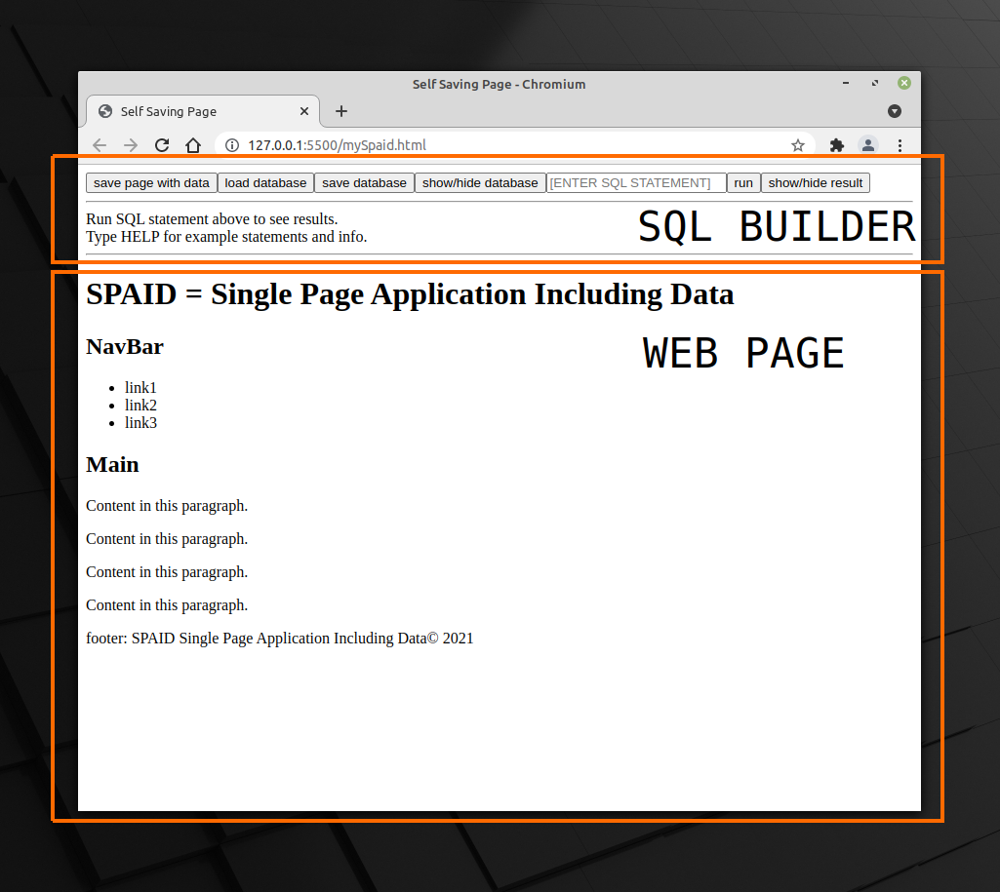

# SPAID
## Single Page Application Including Data
-----------------------

## <span style='color:orange'>UPDATE: </span>What's new 5/23/2022

* The primary focus of this application is storing the data client side.  However, now you can choose to save the data remotely.  You will need a url, username, password, and filename to save the file as.  You can save or load by entering this information in the SQL parser GUI.  See the screenshot below.  However, it is more likely that this information will be supplied in a program you are using the spaid for.  In that case, you can call the functions `saveDatabaseRemote(username, password, url, filename, contents, timeoutMS = 2000)` or `loadDatabaseRemote(username, password, url, filename, timeoutMS = 2000)`.


## <span style='color:orange'>UPDATE: </span>What's new 2/6/2022

* Webpage serialization save is fixed for style and script tags:
    This means you can have a single html file with style tags, script tags (including spaid.js), and database all in one file which can either save over itself or save to a new copies with persistent data.  I would not recommend saving over itself at this time, but so far I have had no issues with its functionality.  I would recommend saving copies of the database, or saving the whole file to a new name.
* Now supporting processing of multiple SQL statements separated by semicolon ;  This works in the run box in the SQL builder window or by calling the function sqlQuery();

## Up next
* Possible sync or fetch operation from local database to online backup.
* SQL dump function for database recreation.

## Why would I want to use this?

* Ordinarily a web page consists of its content, style, and functionality through HTML, CSS, and JavaScript.
* However, to take your page to the next level, you ordinarily would connect to a database, allowing for persistence and additional functionality, opening up many possibilities.
* With this script, instead of reading and writing back and forth from a separate server (or local installed server), the script allows the applicaion to read and write to itself.
* IMPORTANT:  Please note web pages built should be opened directly as a file, not with a live server.

## How does it work?

* The script works by keeping your application's data in a JSON string, which is added to a hidden div.  Whenever the applications data changes, the JSON string in the hidden div changes.

## How do I add it to an existing page?
* place a script tag to spaid.js just before the ending body tag in the html file. `example: <script src='spaid.js'></script>`.  This example assumes your spaid.js file is in the same folder as your webpage.  Otherwise, use the appropriate relative or absolute path.

## What happens when I add it.
* The script will insert before the body (at the top of your web page) a SQL interpreter.
* You can use this interpreter to build tables or experiment.
* You can use this interpreter to build tables, but more commonly this would be done in your JavaScript code in the application.
* The script adds a database like object and a set of functions.




## How can I use this script with my web page?
* There is a SQL Builder interpreter window where you can build save and load databases.
* There are a set of functions that can be called from your program.

## What functions come with 'spaid.js'?
1. sqlQuery(mySQLString)
    * Takes an SQL string as it's argument (<span style='color:orange'>UPDATE:</span> now accepting multiple SQL statements separated by semicolon ;.)
    * Executes the SQL statement.
    * It always returns a table-like object, which is an array of objects with key/value pairs.  (key=fieldname, value = cell value); unless...
    * there is an error and it will return a string error message.
    (this is the currenty behavior but may be changed).
    * <span style='color:orange'>UPDATE:</span> If running multiple statements, returns the last processed SQL statement's table-like object;

2. loadDatabase()
    * Opens a fileDialog where the user can choose the database to load. 

3. saveDatabase(filename, addDate)
    * Opens a save file dialog or depending on browser, it may save just ask for confirmation
    * Its best to set the browser to ask for location of download
    * filename, the prefilled name for the download when save dialog opens.  If left blank "database.json" will be used.
    * addDate, set to true by default, will add date and time information to the save dialog.

4. savePage()
    * This will take the current web page including the data, 'serialize' it (makes a copy of itself including data), and saves that file.
    * Be careful, you are allowed to overwrite the current loaded page.  It is recommended to save to a new name, then rename the file if you are satisfied with the results.
    * Note: Currently, this only works properly if 'spaid.js' is read in as a separate file.  If you include it in the html file itself in between script tags, this function will not currenlty work properly.
    <span style='color:orange'>UPDATE:</span> The spaid.js code and any other scripting code can now be placed between script tags on the html page.  Also style tags can be used in the html file.  Since this is a new fix, I would strongly recommend not saving over itself and saving an extra copy as I continue to test the program.

## What if I don't want to see an additional window in my page?
You can use the interpreter to build a database, then hide it using the following css:

``` 
#spaid-buttons,
#spaid-data,
#spaid-result {
     display: none;
}
```
------------------------
## Advantages/Pros:
--------------------
* This project essentially allows a webpage to store its own 'database' in a hidden div inside of itself.

* This allows for the building of truly cross-platform applications wihtout any external dependencies (like NodeJS).

* This allows for persistence between sessions.

* GUI building is accomplished much easier, faster and better than many other desktop frameworks because the interface is built in HTML, CSS, and JavaScript.

* The application can be copied to a server or used locally.

* The spaid.js file can be placed in the html file and runs on small devices like phones for example.

* When running from a desktop, the webpage can serialize itself (including its own data) and save over itself or to a new filename.

* Requires no special connection to database, it is simply present with the web page.

### These applications offer security in these ways:
1) No installation to the operating system is needed.
2) Source code is readily available by reading the file or examining the browser's developer tools.
3) Input and output from the application to the host computer requires permission from the user.
-----------------------
## Disadvantages/Cons:
1) Persistence between sessions must be approved by the user with a save function (i.e. there are no behind the scene i/o writes to the local system).
2) The entire contents of the database are loaded into local memory, which limits the size of the database.
3) The database is uncompressed human-readable text in JSON format, which is larger than other formats.
4) The speed is not fast.
5) The types of SQL statements are limited as well as the data types to STRING and 'NUMBER'.
6) There is not much error checking when SQL statments are processed, your SQL statements are assummed to be correct.
--------------------------
## When to use:
1. Data persistence is needed, but with relatively smaller amounts of data.  Examples might be personal contacts, timesheets, video game progress and so forth.
2. Local installation of an application is not available on a computer, for example a work computer.
3. The user is comfortable loading and saving their work.
4. The user is ideally able to set the browser to download to a folder of choice.
5. The user's data is typically stored locally (There is not reason you can't just send the JSON data or fetch the data to or from a server for nonlocal storage.
-------------------------------
## Here is an example of the first working application I built using spaid.js.  It is a simple time logger for work related activities:
----------------------


----------------------------------
## The SQL Builder area controls are:
---------------------------------
- `save` - saves a copy of the current webpage containing the database in a hidden div.
- `save database` - which will save a copy of the JSON datbase like object which is hidden in the div.
- `load database` - which will load in the database to the hidden div for use in the web page.
- `show/hide database` - which will toggle the hidden div containing the JSON database-like object.
- `an input box` - you put SQL statments in there.  <span style='color:orange'>UPDATE:</span> Now accepts multiple SQL statements separated by semicolon ;.
- `run button` - which will execute the SQL statements.
- `a show/hide results button` which toggles a tabular format showing the results of the SQL statments.


`The input box and run button can be used to build a database and you can inspect the results
as you build.  You can build your database here much like you might with command line in MariaDB.`

Or you can do it programatically.  I am working on a dump like function which will allow the interpreter to loop through SQL statements and I plan to add a button to the buttons bar 
which will allow for execution of sequential SQL statements.

There are a bunch of functions but they are really intended to be funneled to one central function sqlQuery.

The syntax is like this:
`myTable = sqlQuery(strSQLstring);`

`!Note: The query string always returns a table which is an array of objects with attached metadata.`

The function returns a "table" which is an array or objects.  The array is indexed, the 
rows are objects and their column names are the keys, and the values are the cell data.
The metadata about the table like the name, the next primary key value and the column names
and data types, are attached as properties of the "table" array.

To summarize the table it returns is an array of objects.  So you usually don't think of arrays 
as having properties.  But since arrays are objects, you can attach "properties" to the arrays.
So the arrays will have index rows like:

`thisRowObject = dbObject["mytable"][0];  will return the first row in a table.`

but

`myTableName = dbObject["mytable"]["TABLE_NAME"]; will return the attached property of the table, in this case the name.`

likewise

`thisCustomerID = dbObject["mytable"][3]["customerID"]; will return the customerID found at row 3 in mytable`

but

`thisDataType = dbObject["mytable"]["customerID]; will return "NUMBER" or "STRING" depending on the datatype.`
`

Every time a table is created for example `customers` there will be a second table called `customers_METADATA` which
contains the TABLE_NAME, NEXT_PRIMARY_KEY, and column names and datatypes (STRING or NUMBER).

You can use the built in SQL interpreter to build a database or inspect it.  The interpreter calls the sqlQuery function
and displays a result in a tabular form.  If you call the sqlQuery function in the program the tabular form is not displayed.

Either way something is written to the console to be inspected.

To use, add the javascript reference before the end of the body and it will insert a fresh
'database' if there isn't one present.

It is essentially not styled, but I would exect someone to only display the save and perhaps
save database and load database functions.  The styling is left up to the user.  I envision a little button or maybe 
transulcent bar at the top of the browser or maybe something like what 'citrix' does. in terms of looks.

Currently, a sample database of pet owners and
pets is loaded in the sample webpage mySpaid.html.

There is a SQL interpreter with visualization of both the tables and the database available
at the top of the web page.

Please see the list of keywords, acceptable SQL statments and type-in tutorial below.

Right now you can only INNER JOIN two tables, but you can insert the result to another table.

Then you can rename the columns, then repeat another INNER JOIN.  The INNER JOIN always returns column names which are combined like customers_customerID and with the _ instead of the . notation.

--------------------------
## Please note the special use of the \`\`s around data entries in certain SQL statements.  Currently there are a limited number of SQL statements available, but as the program develops more will be added.  
----------------------------
# Please note webpages built should be opened directly as a file, not with a live server.

<pre>
Available datatypes are STRING or NUMBER.

Available SQL statements:
-----------------------------
CREATE TABLE table_name (column1 datatype, column2 datatype, column3 datatype...);
SHOW TABLES;
DESCRIBE table_name;
DROP TABLE table_name;
ALTER TABLE table_name ADD column_name datatype;
ALTER TABLE table_name DROP COLUMN column_name;
ALTER TABLE table_name CHANGE samename samename newdatatype;
ALTER TABLE table_name CHANGE oldname newname samedatatype:
ALTER TABLE table_name CHANGE oldname newname newdatatype;
INSERT INTO table_name (column1, column2, column3, ...) VALUES (`value1`, `value2`, `value3`, ...);
UPDATE table_name SET column1 = `value1`, column2 = `value2`, ... WHERE condition;
DELETE FROM table_name WHERE condition;
SELECT * FROM table_name;
SELECT column1, column2, ...FROM table_name;
SELECT column1, column2, ... FROM table_name WHERE condition;
SELECT column1, column2, ... FROM table_name ORDER BY column ASC|DESC;
SELECT column1, column2, ... FROM table1 INNER JOIN table2 ON table1.column_name = table2.column_name;
INSERT INTO newtable [a SELECT statement];
HELP

Reserved Keywords:
-----------------------------
INNER, JOIN, SELECT, INSERT, INTO, UPDATE, DELETE, CREATE, DROP, TABLE, SHOW, TABLES, DESCRIBE, HELP, SET,
WHERE, VALUES, ON, PRIMARY_KEY, NEXT_PRIMARY_KEY, _METADATA, STRING, NUMBER, 
=, !=, <>, >=, <=, >, <, * `(back ticks), <span style='color:orange'>UPDATE:</span> NOLOCIMES, ERROR added to list.

Notes:
-----------------------------
 Datatypes are STRING and NUMBER.
 ; not needed.
 use `backticks` around all values whether STRING OR NUMBER
 CAPITALIZATION of keywords is required.
 All tables are autoincremented starting at 1.
 Column name of primary key is PRIMARY_KEY.
 INNER JOIN will give back combined column names, but can be renamed

Examples/Tutorial:
-----------------------------
CREATE TABLE owners (firstname STRING, lastname STRING, email STRING, age NUMBER);
INSERT INTO owners (firstname, lastname, email) VALUES (`John`, `Jones`, `john@gmail.com`);
INSERT INTO owners (firstname, lastname, email, age) VALUES (`David`, `Davis`, `ddavis@gmail.com`,`73`);
INSERT INTO owners (firstname, lastname, email) VALUES (`Justin`, `Thyme`, `justint@gmail.com`);
CREATE TABLE pets (name STRING, sex STRING, pettype STRING, ownerID NUMBER);
SHOW TABLES;
SELECT * FROM owners;
SELECT * FROM pets;
INSERT INTO pets (name, sex, pettype, ownerID) VALUES (`fido`, `female`, `dog`, `3`);
INSERT INTO pets (name, sex, pettype, ownerID) VALUES (`cuddles`, `female`, `cat`, `3`);
INSERT INTO pets (name, pettype, ownerID) VALUES (`gina`, `guinea pig`, `3`);
INSERT INTO pets (name, pettype, ownerID) VALUES (`jeany`, `guinea pig`, `3`);
INSERT INTO pets (name, sex, pettype, ownerID) VALUES (`sherman`, `male`, `dog`, `2`);
INSERT INTO pets (name, sex, pettype, ownerID) VALUES (`freddie`, `male`, `dog`, `1`);
UPDATE pets SET sex = `male`, name = `gene` WHERE name =`gina`;
SELECT * FROM pets;
UPDATE pets SET sex = `male`, ownerID = `5` WHERE pettype = `guinea pig`;
ALTER TABLE pets ADD weight NUMBER;
UPDATE pets SET weight = `70` WHERE name = `sherman`;
DESCRIBE pets;
SELECT owners.PRIMARY_KEY, pets.ownerID, owners.firstname, pets.name FROM owners INNER JOIN pets ON owners.PRIMARY_KEY = pets.ownerID;
INSERT INTO petDirectory SELECT pets.ownerID, owners.firstname, pets.name FROM owners INNER JOIN pets ON owners.PRIMARY_KEY = pets.ownerID;
DESCRIBE petDirectory;
SELECT * FROM petDirectory;
ALTER TABLE petDirectory CHANGE pets_ownerID ownerID STRING;
ALTER TABLE petDirectory CHANGE pets_name name STRING;
ALTER TABLE petDirectory CHANGE owners_firstname owner STRING;
SHOW TABLES;
INSERT INTO directory SELECT * FROM petDirectory;
SHOW TABLES;
DROP TABLE petDirectory;
SHOW TABLES;
ALTER TABLE owners ADD telephone STRING;
UPDATE owners SET telephone = `3042321000` WHERE PRIMARY_KEY = `2`;
DESCRIBE owners;
ALTER TABLE owners CHANGE telephone telephone NUMBER;
DESCRIBE owners;
SELECT * FROM owners;
INSERT INTO dogsOnly SELECT * FROM pets WHERE pettype = `dog` ORDER BY ownerID DESC;
SELECT * FROM dogsOnly;
ALTER TABLE dogsOnly DROP COLUMN pettype;
INSERT INTO dogNames SELECT name FROM dogsOnly;
SHOW TABLES;
</pre>